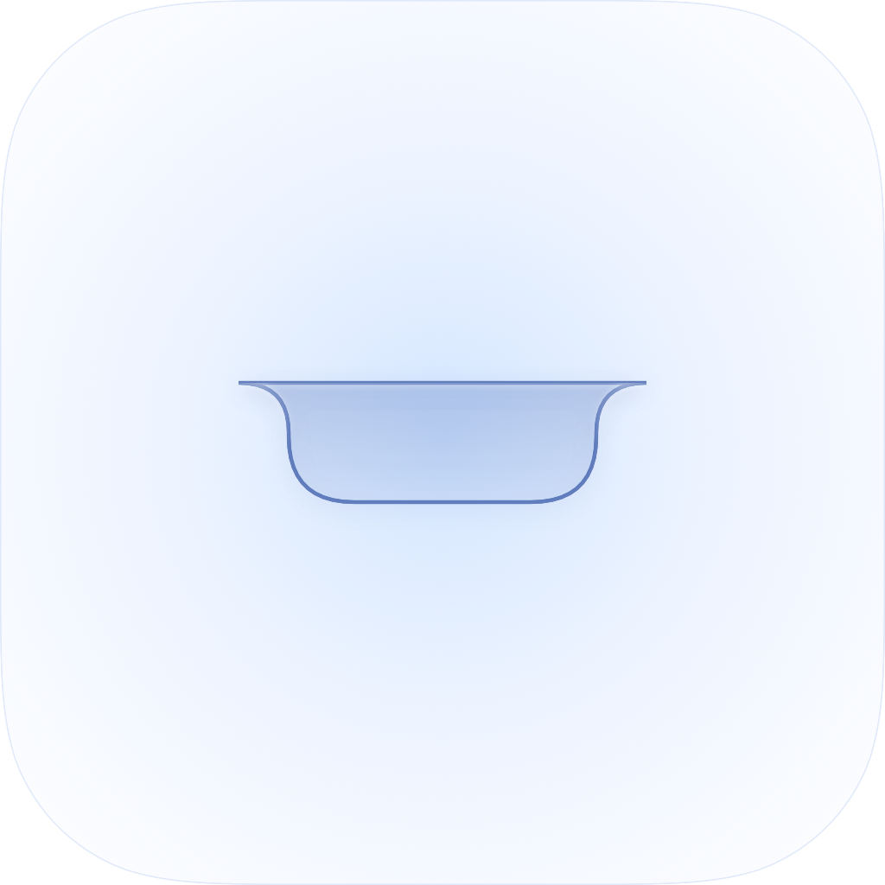

<div align="center">



# Notch — Liquid Glass

A native macOS app that turns the Mac's notch into a Liquid-Glass AI input.

</div>

Hover the notch and it grows downward, melting through one continuous gradient
into dark, translucent "obsidian" glass. Type a question, get an answer, and it
retracts when you leave — no separate floating popover.

## What it does

- **Resting** → a clean black notch with a camera dot, pinned to the notched display.
- **Hover** → springs open into a glass panel (`Ask anything`).
- **Send** → calls the AI, shows a "thinking" wave, then the answer. Ask follow-ups inline.
- **Recent** → revisit recent questions, persisted across launches.
- **Auto-retract** on mouse-leave (only when idle); `Esc` or a click outside closes it.

## Build & run

```bash
xcodebuild -project NotchGlass.xcodeproj -scheme NotchGlass -configuration Release \
  -derivedDataPath build build
open build/Build/Products/Release/NotchGlass.app
```

Or open `NotchGlass.xcodeproj` in Xcode and run. Requires macOS 14+ / Xcode 16+.

It runs as an agent app (`LSUIElement`) — no Dock icon, no menu bar item. To quit,
use Activity Monitor or `pkill -f NotchGlass`.

> **Debug:** launch with `NOTCH_OPEN=1` to open at startup, `NOTCH_DEMO=1` to seed a
> sample answer.

## AI backend

The seam is `AIService`. Without an API key it falls back to a stub. With a key, live
answers come from `OpenAICompatAIService` — one thin `URLSession` client for any
**OpenAI-compatible** `/v1/chat/completions` vendor. Two are wired up:

- **MiMo (Xiaomi)** — `mimo-v2.5-pro` · platform.xiaomimimo.com
- **DeepSeek** — `deepseek-chat` · platform.deepseek.com

Pick a provider and paste its key in Settings (⌘,). Keys are stored in the Keychain.
Adding another vendor is a one-line `case` in `Provider`.

> ⚠️ These are client-side keys. Fine for personal use; move them behind a backend
> before distributing.

## Project layout

```
NotchGlass/Sources/
  NotchGlassApp.swift    App entry (agent app)
  AppDelegate.swift      Pins the notch panel; tracks screen changes
  NotchPanel.swift       Borderless, transparent, all-Spaces NSPanel
  ContentView.swift      Canvas + spring-animated island + Esc
  GlassBackground.swift  NotchShape + black→obsidian-glass material
  NotchBody.swift        idle / load / result content + Recent list
  Components.swift       PromptField, SendButton, ThinkingDots, markdown
  NotchModel.swift       State machine, history, AI calls
  DesignSystem.swift     Color scale, font, dimensions
  AIService.swift        AI seam + offline stub

design_bundle/           Original design handoff (HTML prototype + chat)
```
